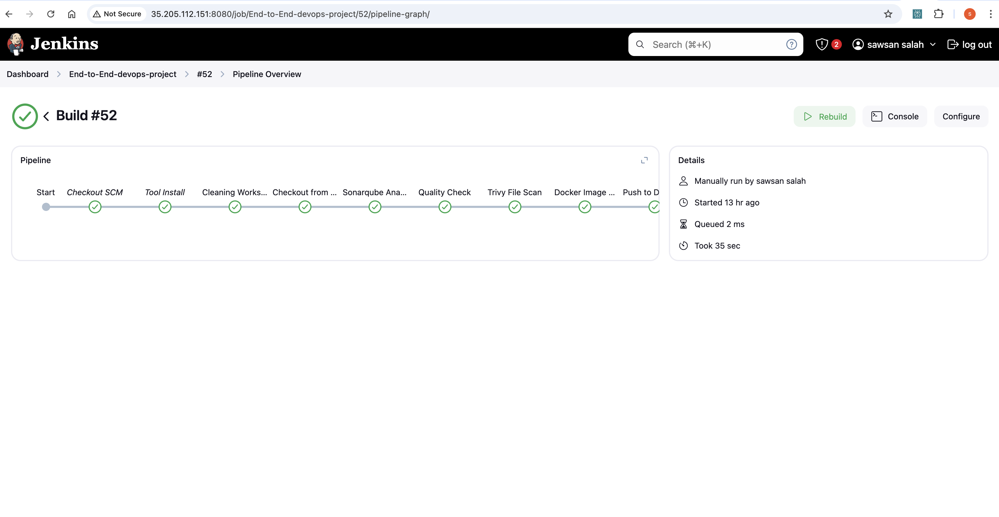
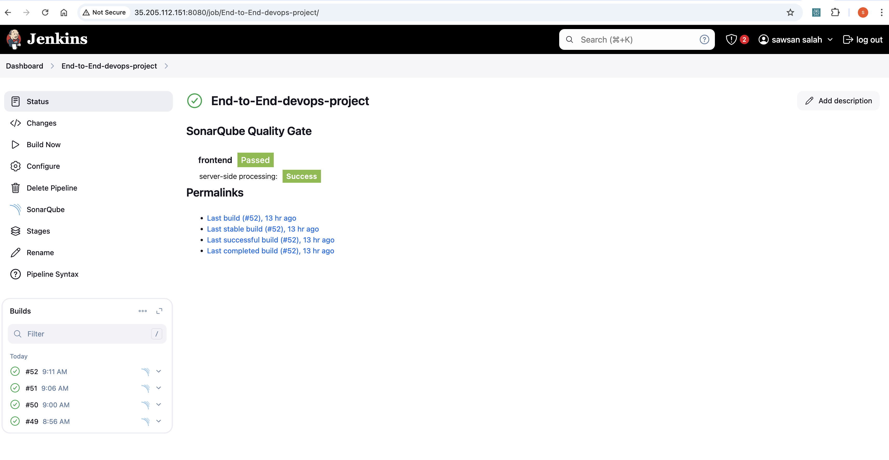

#  Microservice Application Deployment on GCP GKE using GCP GKE, ArgoCD, Prometheus, Grafana, and Jenkins


Welcome to the Microservice Application Deployment project! 🚀


## Table of Contents
- [Microservice Application Deployment on GCP GKE using GCP GKE, ArgoCD, Prometheus, Grafana, and Jenkins](#Microservice-application-deployment-on-gcp-gke-using-gcp-gke-argocd-prometheus-grafana-andjenkins)
  - [Table of Contents](#table-of-contents)
  - [Application Code](#application-code)
  - [GKE Code](#GKE-terraform)
  - [Jenkins Server Terraform](#jenkins-server-terraform)
  - [Kubernetes Manifests Files](#kubernetes-manifests-files)
  - [Project Details](#project-details)
  - [Getting Started](#getting-started)


## Application Code
The `Application-Code` directory contains the source code for the microservice Application. 

## GKE-terraform
In the `GKE-terraform` directory, you'll find Terraform to provision a Google Kubernetes Engine (GKE) cluster.

## Jenkins Server Terraform
Explore the `Jenkins-Server-TF` directory to find Terraform scripts for setting up the Jenkins Server on GCP. These scripts simplify the infrastructure provisioning process.

## Kubernetes Manifests Files
The `Kubernetes-Manifests-Files` directory holds Kubernetes manifests for deploying your application on GCP GKE.
## Project Details
🛠️ **Tools Explored:**
- Terraform & Gcloud CLI for GCP infrastructure
- Jenkins, Sonarqube, Terraform, Kubectl, and more for CI/CD setup
- Helm, Prometheus, and Grafana for Monitoring
- ArgoCD for GitOps practices

🚢 **High-Level Overview:**
- Service Account setup & Terraform magic on GCP
- Jenkins deployment with GCP integration
- GKE Cluster creation & Load Balancer configuration
- Helm charts for efficient monitoring setup
- GitOps with ArgoCD 


## Getting Started

## Project Overview:

Create a GCP Project: Create a Project and a Service Account on GCP with the necessary permissions to facilitate deployment and management activities from local.

Infrastructure as Code (IaC): Use Terraform and Gcloud CLI to set up the Jenkins server (Compute Engine) on GCP.

Jenkins Server Configuration: Install and configure essential tools on the Jenkins server, including Jenkins itself, Docker, Sonarqube, Terraform, Kubectl, Gcloud CLI, and Trivy.

GKE Cluster Deployment: Utilize “gcloud container” commands to create an Amazon GKE cluster, a managed Kubernetes service on GCP.
Load Balancer Configuration: Configure GCP Application Load Balancer (ALB) for the GKE cluster.

Docker  Repositories: push your image to docker repo

ArgoCD Installaion: Install and set up ArgoCD for continuous delivery and GitOps.

Sonarqube Integration: Integrate Sonarqube for code quality analysis in the DevSecOps pipeline.

Jenkins Pipelines: Create Jenkins pipelines for deploying backend and frontend code to the GKE cluster.

Monitoring Setup: Implement monitoring for the GKE cluster using Helm, Prometheus, and Grafana.

ArgoCD Application Deployment: Use ArgoCD to deploy the Microservice application

## Step 1: Deploy k8s cluster using Terraform
Clone the Git repository https://github.com/sawsansalah/End-to-End-GKE-DevOps-Project.git
Navigate to GKE-TF
Modify the bucket name in backend and project name in main.tf in calling module

 using Terraform
Navigate to Jenkins-Server-TF
Modify the bucket name in backend and project name in variables.tfvars
  

Initialize the backend by running the below command
```sh

terraform init

```
You can dry run the changes with

```sh

terraform plan -var-file=variables.tfvars


```
Once you're ready, you can apply the changes with

```sh

terraform apply -var-file=variables.tfvars

```
Now, on GCP console connect to your Jenkins-Server by clicking on SSH and Authorize using google account.


some services such as Jenkins, Docker, Sonarqube, Terraform, Kubectl, Gcloud CLI, and Trivy.

Let’s validate whether all our installed or not
```sh
java --version
jenkins --version
docker --version
docker ps
terraform --version
helm version
trivy --version
gcloud --version
kubectl version


```
## Step 3: integrate Jenkins Server with sonarqube 

follow link https://docs.sonarsource.com/sonarqube/9.9/analyzing-source-code/ci-integration/jenkins-integration/

## step4:  Install & Configure ArgoCD

```sh
kubectl create namespace argocd
kubectl apply -n argocd -f https://raw.githubusercontent.com/argoproj/argo-cd/v2.4.7/manifests/install.yaml
kubectl -n argocd get secret argocd-initial-admin-secret -o jsonpath="{.data.password}" | base64 -d

```


 expose the argoCD server as LoadBalancer using the below command
```sh
kubectl patch svc argocd-server -n argocd -p '{"spec": {"type": "LoadBalancer"}}'           
```


## step 4 : jenkins Pipeline to deploy our frontend Code
Go to Jenkins Dashboard

Click on New Item


Provide the name of your Pipeline and click on OK.


 

Now, click on the build.

Our pipeline was successful after a few common mistakes.

Note: Do the changes in the Pipeline according to your project.






## step 5 : We will set up the Monitoring for our GKE Cluster. We can monitor the Cluster Specifications 

We will achieve the monitoring using Helm
Add the prometheus repo by using the below command

```sh
helm repo add stable https://charts.helm.sh/stable
Install the Prometheus

helm repo add prometheus-community https://prometheus-community.github.io/helm-charts
helm install prometheus prometheus-community/prometheus
helm repo add grafana https://grafana.github.io/helm-charts
helm repo update
helm install grafana grafana/grafana
```


